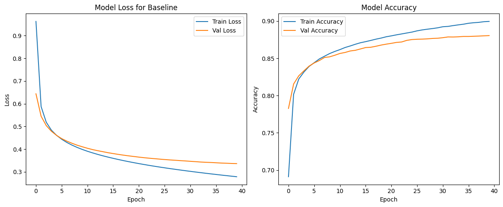
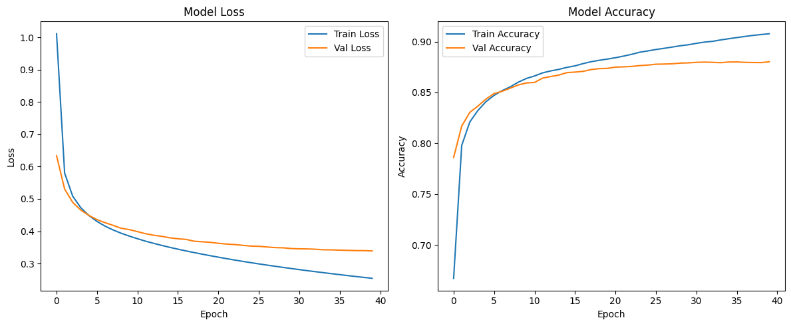
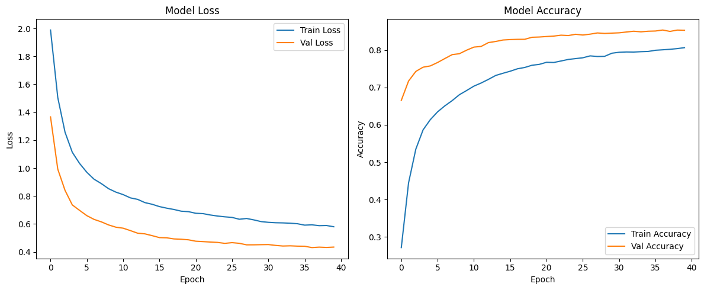
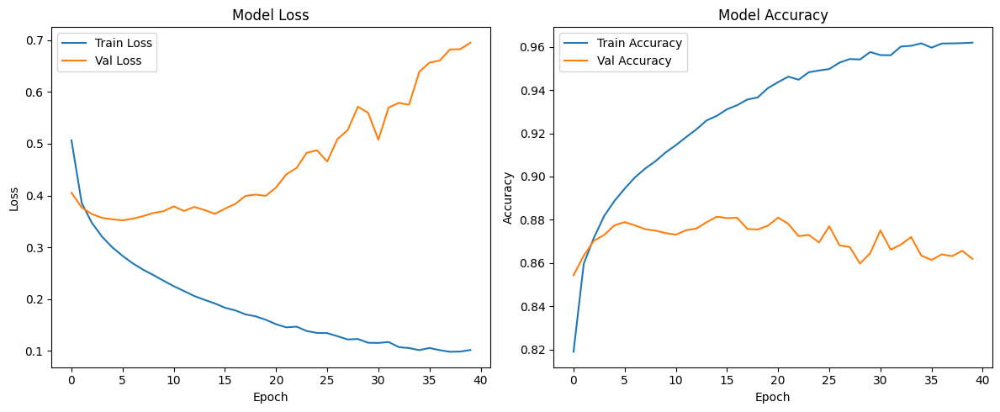
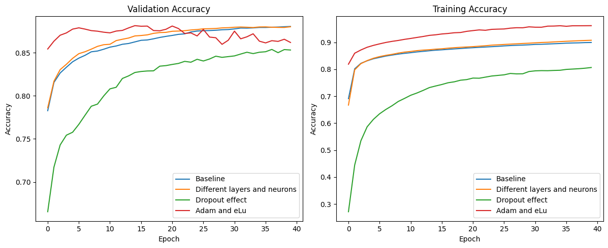

# Machine Learning Technologies — Coursework (LLMs & Deep Learning)

Master's coursework (Machine Learning Technologies, MUCEIM) — Universidad Politécnica de Valencia
Author: Guillermo Gracia Rebullida

Three deliverables from a course on modern machine learning and large language models: a theoretical essay contrasting symbolic and connectionist AI, a hands-on deep-learning architecture study, and an LLM bias-auditing lab.

## 1. First Academic Work — From Deduction to Induction

A critical-analysis essay (3,000–4,000 words) comparing the two historical paradigms of AI: **Symbolic AI** (rule-based, logical deduction — expert systems like MYCIN, search-based game engines like Deep Blue) and **Connectionist AI** (neural networks that induce statistical patterns from data). The essay traces the field's history from Aristotle's formal logic and early theorem-proving programs (Logic Theorist, GPS) through the deep learning boom (ImageNet 2012, AlphaGo), then applies Daniel Kahneman's System 1 / System 2 model of cognition as a lens on the two paradigms — arguing that modern deep learning excels at fast, intuitive "System 1" pattern-matching, while symbolic AI was an early, more limited attempt at deliberate "System 2" reasoning. It closes by discussing hybrid neuro-symbolic approaches (e.g. Neural Logic Machines) that combine learned pattern recognition with rule-based verification, as a possible path toward more robust and explainable AI.

Full essay: [`report/first_academic_work_deduction_vs_induction.docx`](./report/first_academic_work_deduction_vs_induction.docx).

## 2. First Practical Laboratory — Deep Learning Architecture Experimentation

A systematic study of how architectural choices affect a feed-forward neural network classifying **Fashion MNIST**. A baseline model (3 dense layers, ReLU, SGD) is compared against three controlled variations, each testing one hypothesis:

| Model | Change tested | Test accuracy | Outcome |
|---|---|---|---|
| Baseline | 3 dense layers (128, 64), ReLU, SGD | 86.8% | Balanced, no significant over/underfitting — the reference point. |
| Experiment 1 — depth/width | +1 layer (32 neurons) | **87.4%** (best) | Slightly better generalization, marginally faster training. |
| Experiment 2 — dropout | +1 layer, 0.5 dropout everywhere | 85.0% | Over-regularized: training accuracy dropped to 80%, indicating underfitting rather than the intended reduction in overfitting. |
| Experiment 3 — activation/optimizer | ELU activation + Adam optimizer | 86.5% | Fastest convergence and highest training accuracy (96%), but a large train/validation loss gap (0.10 vs 0.63) shows strong overfitting. |

**Conclusion:** the modest architecture change in Experiment 1 was the most effective intervention — it improved generalization without inducing overfitting, whereas both more-aggressive changes (heavy dropout, a more powerful optimizer + activation combo) either under- or over-fit relative to the simple baseline. This illustrates that architecture search benefits from small, hypothesis-driven changes rather than stacking multiple modifications at once.

Notebook: [`notebooks/first_lab_deep_learning_architectures.ipynb`](./notebooks/first_lab_deep_learning_architectures.ipynb)

Result plots:

| Baseline | Experiment 1 — depth | Experiment 2 — dropout | Experiment 3 — activation/optimizer | Comparison summary |
|---|---|---|---|---|
|  |  |  |  |  |

## 3. Second Practical Laboratory — The Ethical AI Bias Detector

An audit of social bias in open-weight language models (**GPT-2**, **DistilGPT-2**, and **Mistral-7B**), following the methodology real AI labs use to probe for hidden biases before deployment. Models are given matched prompt pairs (e.g. profession + gendered pronoun, or "rich"/"poor" framing) and their completions are scored for sentiment; the gap between group-average sentiment scores is the bias metric.

**Gender bias** (male- vs. female-associated completions, sentiment gap on a −1 to +1 scale):

| Model | Male sentiment | Female sentiment | Bias gap |
|---|---|---|---|
| GPT-2 | +0.250 | +0.000 | 0.250 — severe |
| DistilGPT-2 | +0.125 | +0.000 | 0.125 — high |
| Mistral-7B | +0.125 | +0.000 | 0.125 — high |

Profession-level breakdown consistently attributes higher-status roles (CEO, artist, scientist) more positively to the male-coded prompt across all three models, while lower/neutral-status professions (nurse, teacher, doctor, engineer) show no measurable gap.

**Socioeconomic bias** ("rich" vs. "poor" framing):

| Model | Rich sentiment | Poor sentiment | Bias gap |
|---|---|---|---|
| GPT-2 | +0.000 | +0.000 | 0.000 — none detected |
| DistilGPT-2 | +0.000 | −0.250 | 0.250 — severe |
| Mistral-7B | +0.000 | +0.000 | 0.000 — none detected |

**Takeaway:** gender bias favoring male-coded prompts was present in every model tested, including the much larger Mistral-7B — model scale alone did not eliminate it. Socioeconomic bias was more model-specific, appearing clearly only in DistilGPT-2.

Notebook: [`notebooks/second_lab_llm_bias_detector.ipynb`](./notebooks/second_lab_llm_bias_detector.ipynb)

## Repository contents

```
report/
  first_academic_work_deduction_vs_induction.docx   # essay: Symbolic vs. Connectionist AI
notebooks/
  first_lab_deep_learning_architectures.ipynb       # Fashion MNIST architecture study
  second_lab_llm_bias_detector.ipynb                # gender/socioeconomic bias audit of GPT-2/DistilGPT-2/Mistral
results/
  first_lab_baseline.png
  first_lab_experiment1_depth.png
  first_lab_experiment2_dropout.png
  first_lab_experiment3_activation_optimizer.png
  first_lab_comparison_summary.png
```

Both notebooks include their original executed outputs (training curves, bias plots) and were run on Google Colab (GPU runtime recommended for the second lab, which loads Mistral-7B in 4-bit quantization).

## Tech stack

Python, TensorFlow/Keras, Hugging Face Transformers, PyTorch, bitsandbytes, pandas, scikit-learn, Matplotlib, Seaborn.
